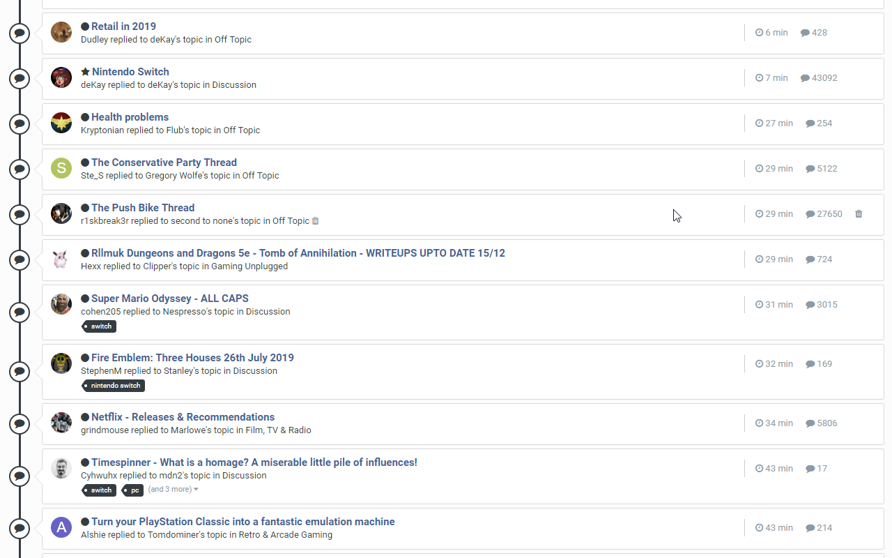
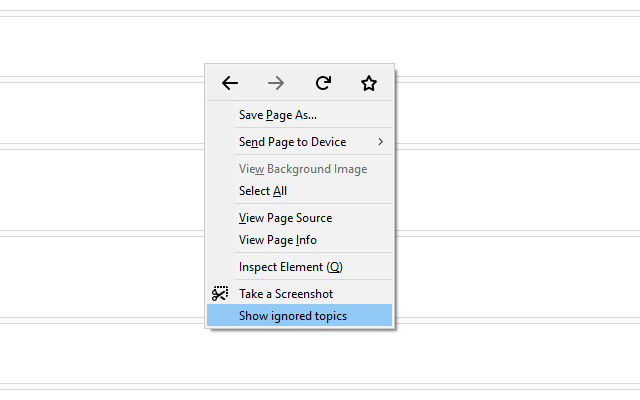
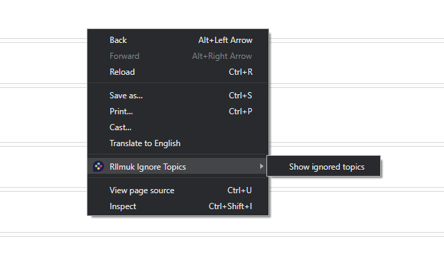
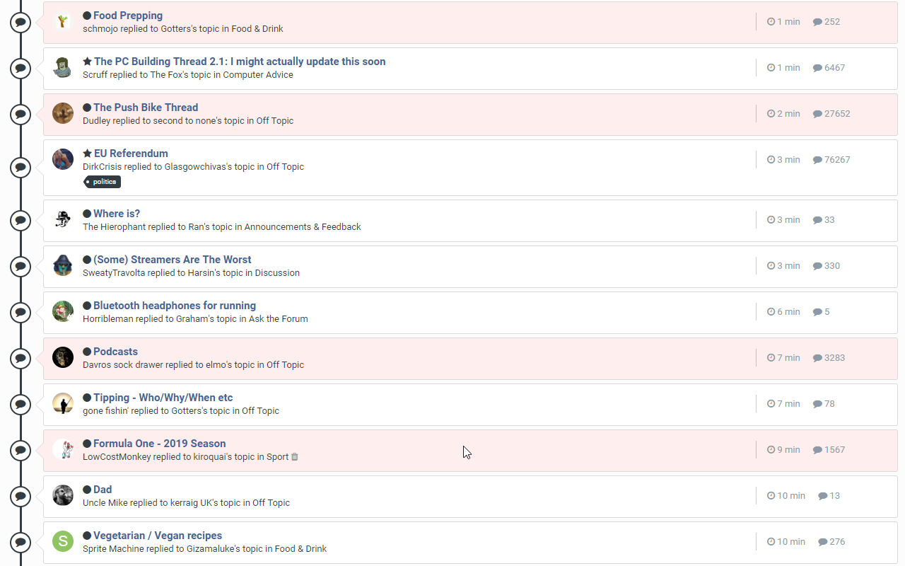
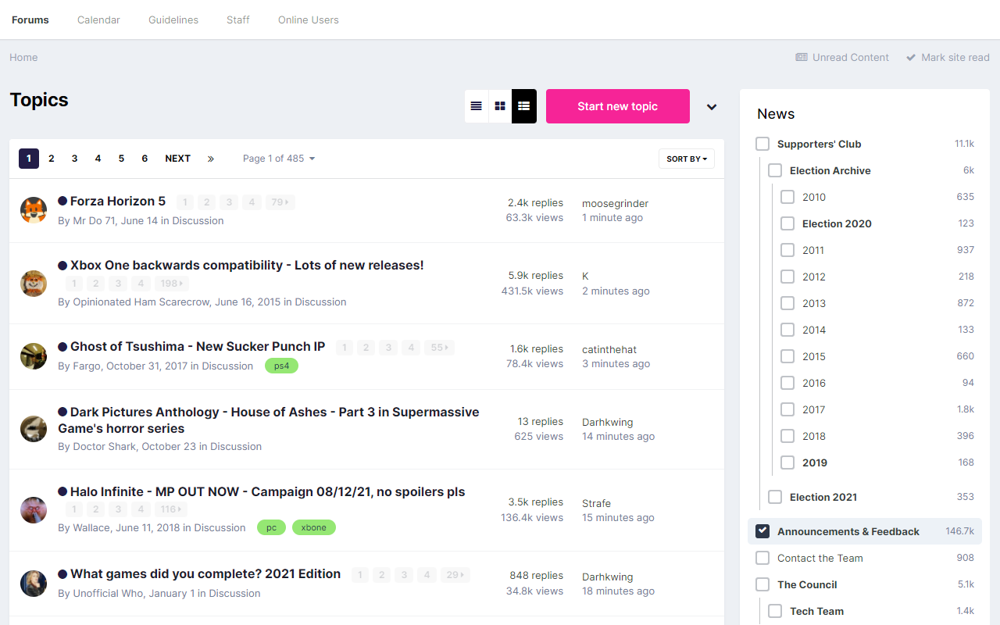
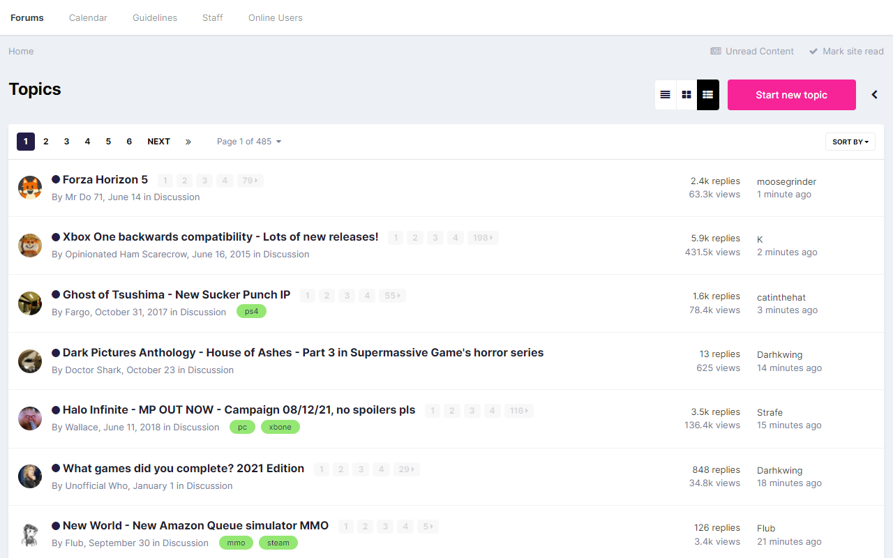

# Rllmuk Ignore Topics

* [Install Chrome Extension](https://chrome.google.com/webstore/detail/llglldgehpbinpbpkegnhbhoiignllmf)
* [Install Firefox Add-on](https://addons.mozilla.org/en-US/firefox/addon/rllmuk-ignore-topics/)
* [Install as a user script](https://greasyfork.org/en/scripts/38321-rllmuk-topic-ignore-list-invision-4) (requires a [user script manager](https://greasyfork.org/en#home-step-1))

## Ignoring

Hover over a topic and a trash icon will appear; clicking it will hide the topic, and it will be hidden on subsequent visits to the forum it's in and on the Unread Content page.

On the Unread Content page, a trash icon will also appear next to the forum a topic is in - clicking it will hide all topics in that forum when browsing Unread Content.

## Unignoring

If you've accidentally ignored the wrong thing, or if you realise you want to read about _insert name of collectible physical object_ or _insert name of football club_ more than you thought, open your browser's right-click/context menu and click "Show ignored topics" (this will be a top-level item in Firefox and under a "Rllmuk Ignore Topics" menu item in Chrome).

| Firefox | Chrome |
|:-------:|:------:|
|  |  |

Ignored topics will be displayed with a fetching salmon highlight and clicking the appropriate trash icon (you may have ignored a topic individually, by forum or both) will unignore them. You can then re-hide ignored topics using the same menu item.

## Bonus Feature: Hide Fluid Sidebar

When using the forum's Fluid view, a collapse/expand button will also be added which allows you to hide the sidebar once you're done picking folders:

| Expanded | Collapsed |
|:--------:|:---------:|
|  |  |